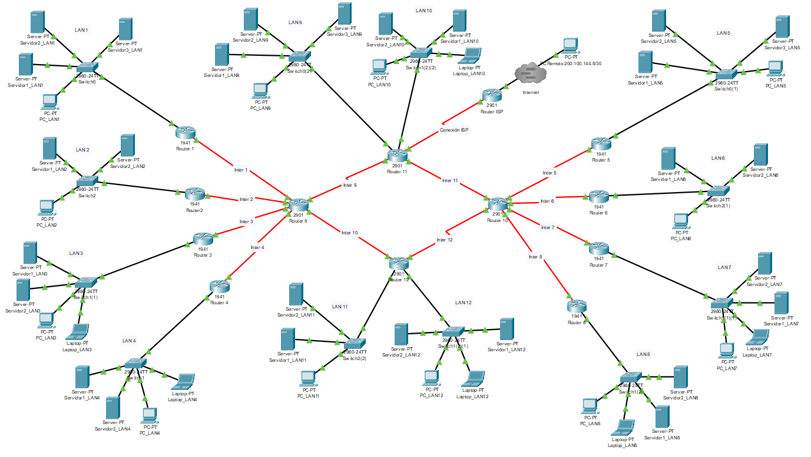

* # Proyecto de Redes: Enrutamiento Híbrido (Estático y RIPv2)

## 1. Descripción del Proyecto

Este repositorio contiene el desarrollo de un proyecto académico de redes de computadoras II que implementa una topología de red compleja para simular un entorno corporativo. El objetivo principal es demostrar la configuración y coexistencia de múltiples metodologías de enrutamiento (estático y dinámico con RIPv2) para lograr una conectividad total y eficiente entre 12 redes LAN distintas y una conexión a una red externa simulada.

El proyecto abarca desde el diseño del direccionamiento IP con VLSM hasta la configuración detallada de cada dispositivo, la implementación de NAT para el acceso externo y la verificación exhaustiva de la conectividad.

## 2. Topología de la Red

La red se basa en un diseño jerárquico de tres capas (Núcleo, Distribución y Acceso) utilizando una topología de estrella extendida.

## 3. Tecnologías y Habilidades Demostradas

Este proyecto demuestra competencia en las siguientes áreas clave de la administración de redes:

-   **Diseño de Redes Jerárquico:** Implementación de un modelo de red escalable de tres capas.
-   **Direccionamiento IP y Subnetting VLSM:** Planificación y asignación eficiente de direcciones IPv4 para LANs (`/28`) y enlaces WAN (`/30`).
-   **Enrutamiento Estático:** Configuración de rutas estáticas específicas, sumarizadas y por defecto.
-   **Enrutamiento Dinámico:** Implementación y configuración del protocolo de enrutamiento `RIPv2`, incluyendo el uso de `passive-interface` y la deshabilitación de `auto-summary`.
-   **Coexistencia y Redistribución de Rutas:** Integración exitosa de un dominio de enrutamiento estático con uno dinámico, utilizando `default-information originate` para redistribuir una ruta por defecto.
-   **Network Address Translation (NAT):** Configuración de NAT con sobrecarga (PAT) en el router de borde para permitir la comunicación entre la red privada interna y una red externa.
-   **Configuración de Routers Cisco (CLI):** Uso de la interfaz de línea de comandos de Cisco IOS para configurar interfaces, protocolos de enrutamiento y otras funcionalidades de red.
-   **Verificación y Troubleshooting:** Diagnóstico y validación de la conectividad de red de extremo a extremo mediante herramientas como `ping` y `tracert`, y comandos de verificación como `show ip route` y `show ip protocols`.

## 4. Estructura del Repositorio

-   `/R3.0_Redes II - Packet Tracer para Proyecto Interciclo_Balon.pkt`: Archivo de Cisco Packet Tracer con la topología completamente configurada y funcional.
-   `/Proyecto Interciclo de Redes II_AlexBalon`: Documento técnico del proyecto que detalla el diseño, desarrollo, análisis y conclusiones.
-   `/README.md`: Este archivo.

## 5. Resumen de la Configuración de Enrutamiento

La red está dividida en dos dominios de enrutamiento principales que coexisten:

-   **Zona Estática (R1, R2, R3, R4, R9, R11):** Los routers de acceso (R1-R4) utilizan rutas por defecto hacia el núcleo. Los routers de núcleo (R9, R11) utilizan una combinación de rutas estáticas específicas, rutas sumarizadas y rutas por defecto para dirigir el tráfico de manera eficiente.
-   **Zona Dinámica (R5, R6, R7, R8, R10, R12):** Estos routers utilizan `RIPv2` para aprender y anunciar rutas automáticamente. El router de borde `R10` inyecta una ruta por defecto en este dominio, proporcionando a todas las LANs de esta zona una salida al resto de la red.

## 6. Cómo Probar

1.  Descargar y abrir el archivo `.pkt` con una versión compatible de **Cisco Packet Tracer**.
2.  Esperar unos 60 segundos para que los protocolos (STP, RIP) converjan completamente.
3.  Realizar pruebas de `ping` entre dispositivos de diferentes LANs para verificar la conectividad. Por ejemplo, desde un PC en `LAN 1` a un Servidor en `LAN 8`.
4.  Para probar la conectividad intra-LAN con la herramienta "Simple PDU" (el sobre), recordar la técnica del **"Doble Toque"**: el primer intento puede fallar debido al proceso de ARP, pero el segundo intento inmediato debe ser exitoso.

## 7. Autor

-   Alex Balón
